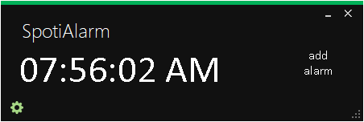
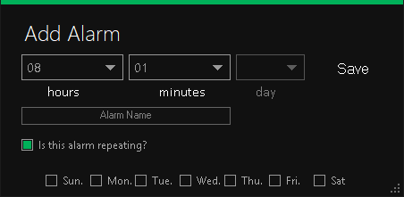
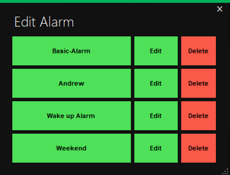
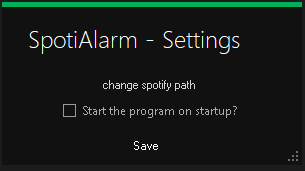

# Welcome 
Plays the last selected playlist when the alarm is triggered.

# HomeScreen

  

### AddAlarm

  

### AlarmEdit

  

### Settings

  

# Future Plans
1. Add background worker to properly update the Homescreen when the alarm is being called.
2. Add the spotify API to better implement usage with playlist selections & controls. 
